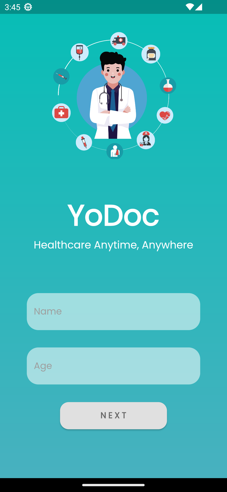
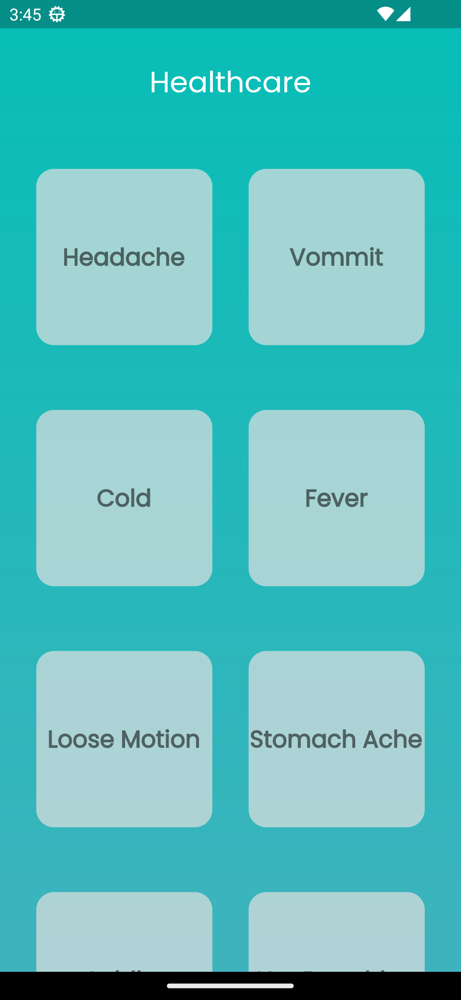
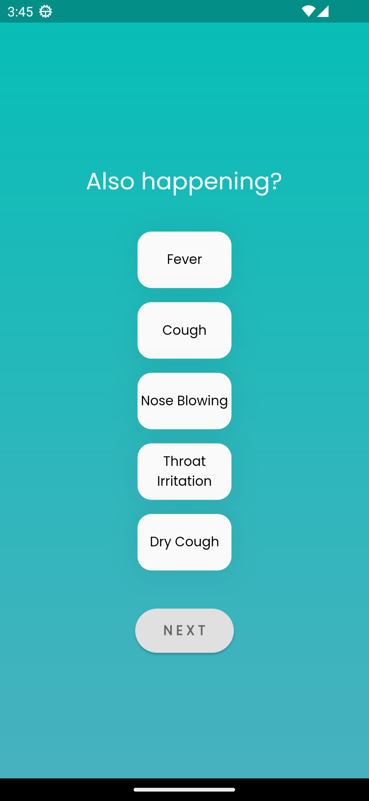
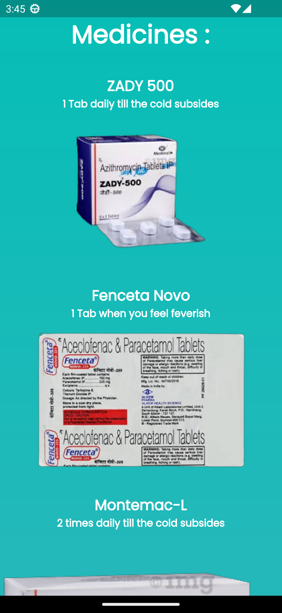

<a href='https://play.google.com/store/apps/details?id=com.shenmareparas.yodoc'></a>

# YoDoc - Virtual Doctor App

YoDoc is a virtual doctor app built using Flutter and Dart that allows users to conveniently get prescription for disease. Users can receive prescription suggestions anywhere, anytime.

<a href='https://play.google.com/store/apps/details?id=com.shenmareparas.yodoc'></a>

## Features

-   **Prescription Suggestions**: YoDoc can provide users with suggested prescriptions for their health condition.
-   **User-friendly Interface**: YoDoc has a clean and intuitive user interface that makes it easy for users to navigate through the app and access the features they need.

## Screenshots

<table>
  <tr>
    <td></td>
    <td></td> 
  </tr>
  <tr>
  <td></td>
    <td></td>
  </tr>
</table>

## Technologies Used

-   Flutter and Dart for building the mobile app
-   Visual Studio Code
-   Lottie
-   Cupertino Icons
-   Google Fonts

## Getting Started

To get started with YoDoc, follow these steps:

1. Clone the repository to your local machine.

```bash
git clone https://github.com/shenmareparas/YoDoc.git
```

2. Install the dependencies for the app.

```bash
flutter pub get
```

3. Start the app.

```bash
flutter run
```

4. Open the YoDoc app on your emulator or device.

## Contributing

I welcome contributions from the community! If you'd like to contribute to YoDoc, please fork the repository, create a branch, and submit a pull request with your changes. Make sure to follow the code style and commit message conventions outlined in the repository.

## Contact

If you have any questions, suggestions, or feedback, please feel free to contact me at shenmareparas@gmail.com or create an issue in the repository. I'd love to hear from you!

## Privacy Policy

https://www.termsfeed.com/live/093596c6-e069-4723-91f8-aed61e2da0c3

## Enjoy YoDoc!
