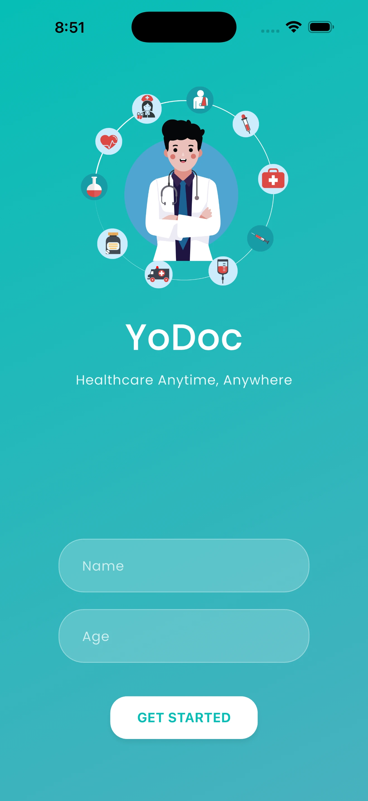
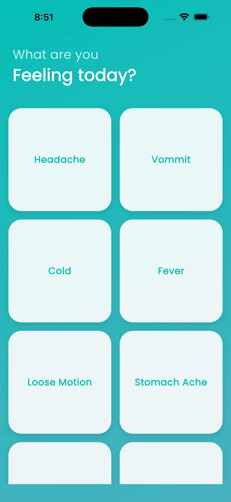
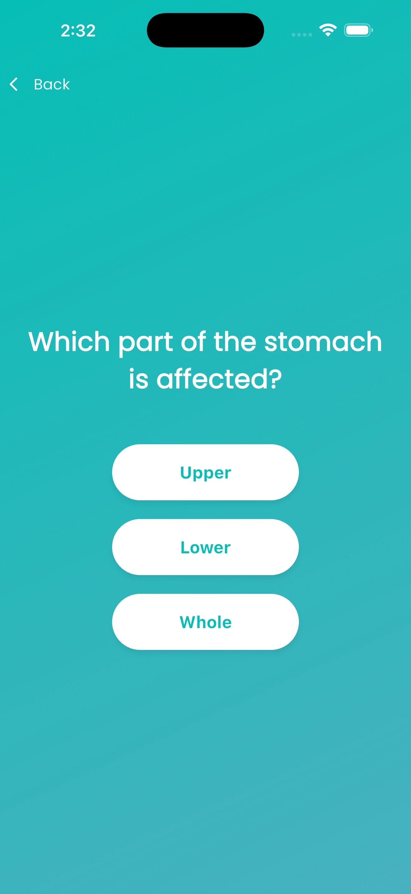
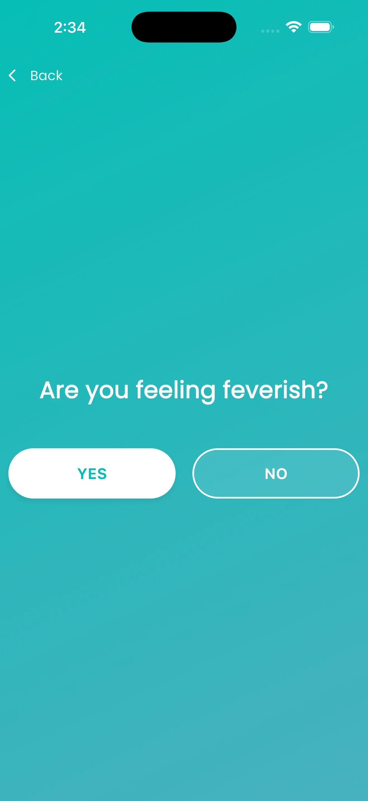
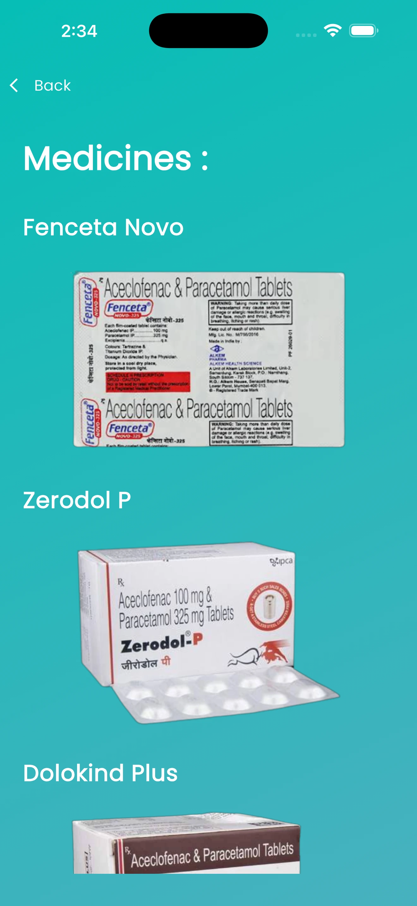

<a href='https://play.google.com/store/apps/details?id=com.shenmareparas.yodoc'></a>

# YoDoc - Virtual Doctor App

YoDoc is a virtual doctor app built using Flutter and Dart that allows users to conveniently get prescriptions for diseases. Users can receive prescription suggestions anywhere, anytime.

<a href='https://play.google.com/store/apps/details?id=com.shenmareparas.yodoc'></a>

## Table of Contents

-   [Features](#features)
-   [Screenshots](#screenshots)
-   [Technologies Used](#technologies-used)
-   [Getting Started](#getting-started)
-   [Contributing](#contributing)
-   [Contact](#contact)
-   [Privacy Policy](#privacy-policy)

## Features

-   **Prescription Suggestions**: YoDoc provides users with suggested prescriptions for their health conditions based on symptoms.
-   **User-friendly Interface**: Clean and intuitive UI designed for ease of navigation.
-   **Secure & Private**: Your health data is treated with privacy.

## Screenshots

<table>
  <tr>
    <td></td>
    <td></td>
    <td></td>
  </tr>
  <tr>
    <td></td>
    <td></td>
  </tr>
</table>

## Technologies Used

-   **Flutter** & **Dart**: Core mobile application framework.
-   **Visual Studio Code**: IDE.
-   **Lottie**: For beautiful animations.
-   **Cupertino Icons**: iOS-style icons.
-   **Google Fonts**: Typography.

## Getting Started

To get started with YoDoc, follow these steps:

### Prerequisites

-   Flutter SDK installed on your machine.
-   A device or emulator to run the app.

### Installation

1.  **Clone the repository** to your local machine.

    ```bash
    git clone https://github.com/shenmareparas/YoDoc.git
    cd YoDoc
    ```

2.  **Install the dependencies**.

    ```bash
    flutter pub get
    ```

3.  **Start the app**.

    ```bash
    flutter run
    ```

## Contributing

Contributions are welcome! If you'd like to contribute:

1.  Fork the repository.
2.  Create a branch for your feature/fix.
3.  Submit a pull request.

Please follow the code style and conventions used in the project.

## Contact

If you have any questions, suggestions, or feedback, please feel free to contact me at [shenmareparas@gmail.com](mailto:shenmareparas@gmail.com) or create an issue in the repository.

## Privacy Policy

[View Privacy Policy](https://www.termsfeed.com/live/093596c6-e069-4723-91f8-aed61e2da0c3)

## Enjoy YoDoc!
